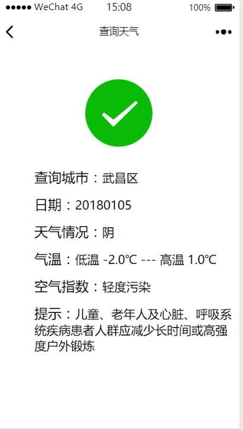
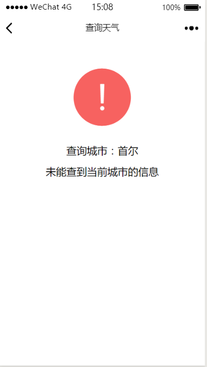

WeChatWeather文件夹里的是天气查询小程序文件，该小程序只包含两个简单的页面。

* 首页为搜索页面，根据微信提供的定位功能以及结合高德地图API的逆向地址查询功能，获取当前所在位置
，也可以自定义查询，手动输入城市名称进行查询
* 查询的天气结果页面通过万年历的天气API接口获取，可获取当天的天气以及未来几天的天气信息。
* 查询不到会转到错误信息提示页面

* 运行截图如下：

